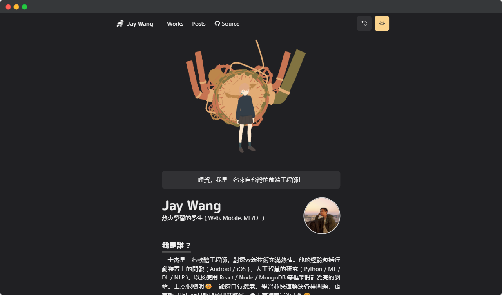
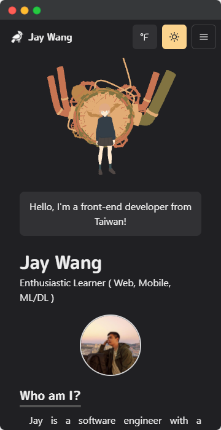
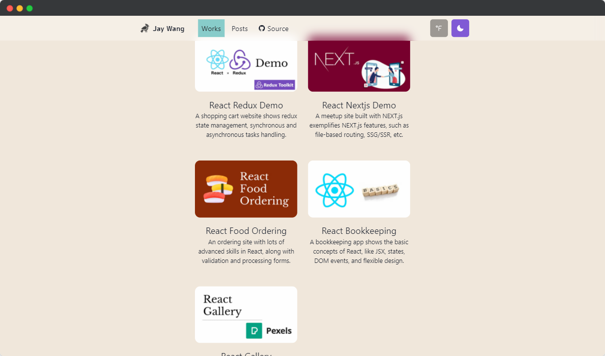
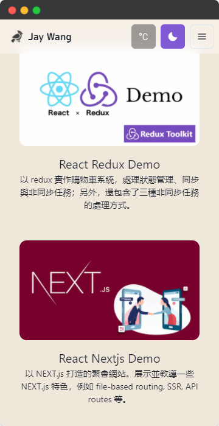

<!-- PROJECT LOGO -->
 

  

  <h3 align="center">Jay's Homepage</h3>
  
This homepage is designed based on craftzdog's tutorial and has additional data models and i18n features.
     
    <a href="https://www.jaywang.xyz">View Demo</a>
    ·
    <a href="https://github.com/windsuzu/jaywang-homepage/issues">Report Bug</a>
    ·
    <a href="https://github.com/windsuzu/jaywang-homepage/issues">Request Feature</a>
  

<!-- ABOUT THE PROJECT -->
## About

<table>
<tr>
<td>

這個專案基於 [Takuya Matsuyama - craftzdog](https://github.com/craftzdog) 的教學 [[How to build a portfolio website using Next.js, Chakra UI, Framer Motion, and Three.js]](https://www.youtube.com/watch?v=bSMZgXzC9AA) 加以設計，並將資料模型 (data) 與頁面元件 (page component) 分開儲存，還額外添加了 i18n 與轉換語言功能。

**Built With**

* React, Next.js, i18n
* Chakra UI
* Framer Motion
* Three.js

</td>
</tr>
</table>

## Preview

  
  
  
  

## License

Distributed under the MIT License. See [LICENSE](https://github.com/windsuzu/jaywang-homepage/blob/main/LICENSE) for more information.

## Contact

Reach out to the maintainer at one of the following places:

* [GitHub discussions](https://github.com/windsuzu/jaywang-homepage/discussions)
* The email which is located [in GitHub profile](https://github.com/windsuzu)

## Acknowledgements

* [Takuya Matsuyama - craftzdog](https://github.com/craftzdog)